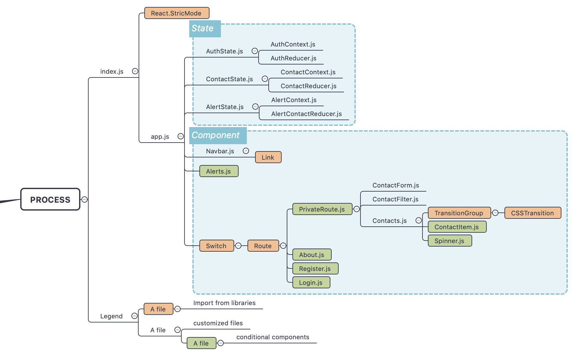

# Frontend File Structure

Overview of the file structure

| File Tree                   | functionality                                    |
| --------------------------- | ------------------------------------------------ |
| 📦client                    |                                                  |
| ┣ 📂node_modules            |                                                  |
| ┣📂public                   | `(React public folder)`                          |
| ┣ 📜favicon.ico             |                                                  |
| ┣ 📜index.html              |                                                  |
| ┣ 📜manifest.json           |                                                  |
| ┣ 📂src                     | `(Everything in development)`                    |
| ┃ ┣ 📂components            | `(All components in React application)`          |
| ┃ ┃ ┣ 📂auth                | `(authrization related pages)`                   |
| ┃ ┃ ┃ ┣ 📜Login.js          | (login page component)                           |
| ┃ ┃ ┃ ┗ 📜Register.js       | (register page component)                        |
| ┃ ┃ ┣ 📂contacts            | `(folder of contact related components)`         |
| ┃ ┃ ┃ ┣ 📜ContactFilter.js  | (ContactFilter component)                        |
| ┃ ┃ ┃ ┣ 📜ContactForm.js    | (ContactForm component)                          |
| ┃ ┃ ┃ ┣ 📜ContactItem.js    | (ContactItem component)                          |
| ┃ ┃ ┃ ┗ 📜Contacts.js       | (ContactItem container component)                |
| ┃ ┃ ┣ 📂layout              | `(folder of layout related components)`          |
| ┃ ┃ ┃ ┣ 📜Alerts.js         | (Alerts component)                               |
| ┃ ┃ ┃ ┣ 📜Navbar.js         | (Navbar component)                               |
| ┃ ┃ ┃ ┣ 📜Spinner.js        | (Spinner component)                              |
| ┃ ┃ ┃ ┗ 📜spinner.gif       | (Spinner resources)                              |
| ┃ ┃ ┣ 📂pages               | `(folder of page related components)`            |
| ┃ ┃ ┃ ┣ 📜About.js          | (About page)                                     |
| ┃ ┃ ┃ ┗ 📜Home.js           | (Home page)                                      |
| ┃ ┃ ┗ 📂routing             | `(folder of special routing related components)` |
| ┃ ┃ ┃ ┗ 📜PrivateRoute.js   | (PrivateRoute page - logged in routes)           |
| ┃ ┣ 📂context               | `(All context files in React)`                   |
| ┃ ┃ ┣ 📂alert               | `(alert context package)`                        |
| ┃ ┃ ┃ ┣ 📜AlertState.js     | (action files)                                   |
| ┃ ┃ ┃ ┣ 📜alertContext.js   | (create context instance)                        |
| ┃ ┃ ┃ ┗ 📜alertReducer.js   | (manipulate state variables)                     |
| ┃ ┃ ┣ 📂auth                | `(auth context package)`                         |
| ┃ ┃ ┃ ┣ 📜AuthState.js      | (action files)                                   |
| ┃ ┃ ┃ ┣ 📜authContext.js    | (create context instance)                        |
| ┃ ┃ ┃ ┗ 📜authReducer.js    | (manipulate state variables)                     |
| ┃ ┃ ┣ 📂contact             | `(contact context package)`                      |
| ┃ ┃ ┃ ┣ 📜ContactState.js   | (action files)                                   |
| ┃ ┃ ┃ ┣ 📜contactContext.js | (create context instance)                        |
| ┃ ┃ ┃ ┗ 📜contactReducer.js | (manipulate state variables)                     |
| ┃ ┃ ┗ 📜types.js            | (Reference of all types used in all contexts)    |
| ┃ ┣ 📂utils                 | (Utility snippets)                               |
| ┃ ┃ ┗ 📜setAuthToken.js     | (Local storage manipulating)                     |
| ┃ ┣ 📜App.css               | (main style sheet)                               |
| ┃ ┣ 📜App.js                | **_(Main Component: App)_**                      |
| ┃ ┣ 📜index.js              | **_(Main app.js)_**                              |
| ┃ ┗ 📜setupTests.js         |                                                  |
| ┣ 📜package-lock.json       | (dependency files)                               |
| ┗ 📜package.json            | (dependency files)                               |

---

## Explanation

### Process of running files

The react application runs `ReactDom.render()` function (imported from `react-dom`) in `index.js`, which imports `App` component from `app.js`. All three states are imported in `app.js`, along with all components (both custom components and components imported from libraries). The components highligheted in red are external components imported from libraries, where other components are customed components. Green highlighted components are rendered in condition. For instance, only one page component a time will be rendered in React application on certain condition. The `PrivateRoute` component is accesible only when the user successfully logged in, which prevents other users to see contacts doesn't belong to them.

### Some terminologies

State:

Similar to props, it contain certain properties in object which can be used for updating an component. However, it is private and fully controlled by the component.

Context:

Context provides a way to pass data through the component tree without having to pass props down manually at every level. In a typical React application, data is passed top-down (parent to child) via props, but this can be cumbersome for certain types of props (e.g. locale preference, UI theme) that are required by many components within an application. Context provides a way to share values like these between components without having to explicitly pass a prop through every level of the tree.

Reducer:

As it is a app-level state, all changes of state variables happens here in reducer and it will change components corresponding to the changes. Alogorithums that decide which components need to be rerendered also applied here after reducer changes the state. In this projects, reducers were seperated to split the "updating state" functionality from state files to increase the readability. 

> *How do `Context` & `Reducer` work together?*

> *It is a way to achive app-level state management. Things are sent down from the state through the reducer and things are sent up through actions. So if we want to add a user, we <u>call an action</u> and then that <u>will dispatch to the reducer</u> and <u>reducer will decide how to manipulate</u> the rest of the application (the rest of the components in UI).*

Component:

A React **Component** is a template. A blueprint. A global definition. This can be either a **function** or a **class** (with a render function). It returns element.

Element:

A React **Element** is what gets **returned** from components. It’s an object that virtually describes the DOM nodes that a component represents. With a _function component_, this element is the object that the function returns. With a _class component_, the element is the object that the component’s `render()` function returns. React elements are not what we see in the browser. They are just objects in memory and we can’t change anything about them.

[An article explainning the differences between components and elements in React](https://www.freecodecamp.org/news/react-interview-question-what-gets-rendered-in-the-browser-a-component-or-an-element-1b3eac777c85)

---

